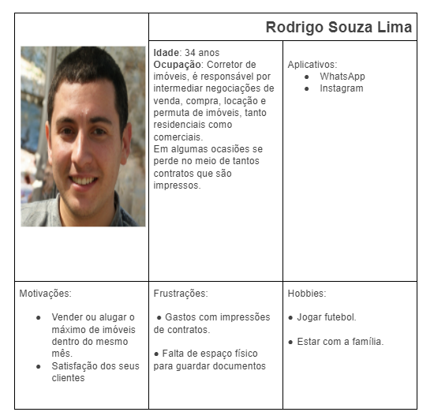
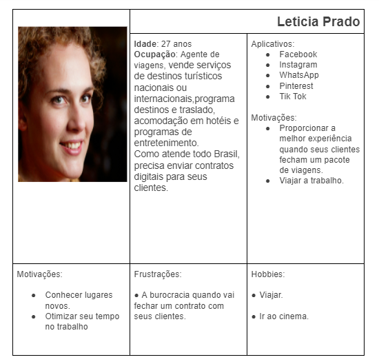

# Especificações do Projeto

Pré-requisitos: <a href="1-Documentação de Contexto.md"> Documentação de Contexto</a>

A definição do problema e os pontos mais relevantes a serem tratados neste projeto foi sugerido necessidade do público-alvo em agilizar suas assinaturas. Os detalhes levantados nesse processo foram consolidados na forma de personas e histórias de usuários.

## Personas

As personas levantadas durante o processo de entendimento do problema são apresentadas na Figuras que se seguem.

 ### Amanda Pinheiro

 ### Rodrigo Souza Lima

 ### Patricia Gonçalves

 ### Leticia Prado

 ### Julia Takahashi

## Histórias de Usuários

Com base na análise das personas forma identificadas as seguintes histórias de usuários:

|EU COMO... `PERSONA`| QUERO/PRECISO ... `FUNCIONALIDADE` |PARA ... `MOTIVO/VALOR`                 |
|--------------------|------------------------------------|----------------------------------------|
|Amanda              | Visualizar documentos pendentes de assinatura          | Otimizar meu tempo |
|Amanda              | Visualizar os documentos já assinados                 | Para gerenciar as demanda |
|Rodrigo             | Enviar os documentos a serem assinados para vários clientes                 | economizar tempo e dinheiro |
|Rodrigo             | Receber alerta de documentos pendentes           | Controlar a o processo               |
|Rodrigo             | Poder arquivar os documentos assinados                  | Economizar papéis |
|Patricia            | Assinar vários documentos online                | Não precisar me locomover |
|Leticia             | Baixar os documentos assinados           | Facilitar o trabalho               |
|Julia               | Postar vários documentos                 | Melhorar qualidade na demanda |
|Julia               | Enviar os documentos através de emails                  | Facilitar o processo |

## Requisitos

O escopo funcional do projeto é definido por meio dos requisitos funcionais que descrevem as possibilidades de interação dos usuários, bem como os requisitos não funcionais que descrevem os aspectos que o sistema deverá apresentar de maneira geral. Estes requisitos são apresentados a seguir.

### Requisitos Funcionais

A tabela a seguir apresenta os requisitos do projeto, identificando a prioridade em que os mesmos devem ser entregues.

|ID    | Descrição do Requisito  | Prioridade |
|------|-----------------------------------------|----|
|RF-001| Deve permitir que os usuários gerenciem um perfil com dados pessoais | ALTA | 
|RF-002| Deve possuir filtros para parametrizar a busca dos documentos armazenados | MÉDIA |
|RF-003| Deve permitir fazer upload dos documentos e armazená-los em sua conta, classificando-os pelo seu respectivo tipo | ALTA |
|RF-004| Deve permitir que os documentos armazenados sejam direcionados a outros usuários para assinatura | ALTA |
|RF-005| Deve disparar um e-mail informando ao destinatário responsável pela assinatura sobre a alteração do status do documento | MÉDIA |
|RF-006| Deve permitir a interação dos usuários por meio da abertura de um tíquete/chamado para alteração das informações contidas no documento, especificando onde é necessário mudar e qual a mudança | MÉDIA |
|RF-007| Deve registrar as informações de data/hora das interações de forma automática | BAIXA |
|RF-008| Deve permitir que o usuário administrador altere/escolha o pacote que mais se adeque ao momento | ALTA |
|RF-009| Deve permitir que o usuário administrador altere as permissões dos demais usuários | ALTA |

### Requisitos não Funcionais

A tabela a seguir apresenta os requisitos não funcionais que o projeto deverá atender. 

|ID     | Descrição do Requisito  |Prioridade |
|-------|-------------------------|----|
|RNF-001| Deve ser publicado em um ambiente acessível (Repl.it, GitHub Pages, Heroku)	 | ALTA | 
|RNF-002| Deve ser responsivo permitindo a visualização em qualquer dispositivo	 | ALTA |
|RNF-003| Deve ter um design simples e autoexplicativo | MÉDIA |
|RNF-004| Deve ser compatível com os principais navegadores do mercado | ALTA |
|RNF-005| Deve estar acessível 24/7 | MÉDIA |
|RNF-006| Deve testar a segurança e veracidade do usuário	 | ALTA |
|RNF-007| Deve possibilitar o armazenamento de arquivos no formato PDF | ALTA |
|RNF-008| Deve possuir filtros para parametrizar a busca | ALTA |

## Restrições

As questões que limitam a execução desse projeto e que se configuram como obrigações claras para o desenvolvimento do projeto em questão são apresentadas na tabela a seguir.

|ID| Restrição                                             |
|--|-------------------------------------------------------|
|RE-01| O projeto deverá ser entregue no final do semestre letivo |
|RE-02| O aplicativo deve se restringir às tecnologias básicas da Web no Frontend |
|RE-03| A equipe não pode subcontratar o desenvolvimento do trabalho |
|RE-04| O projeto não deve ser feito por um único indivíduo |
|RE-05| As decisões pertinentes ao projeto devem ser tomadas por mais de 50% do grupo |
|RE-06| O projeto deve estar em conformidade com as leis vigentes |

## Diagrama de Casos de Uso

