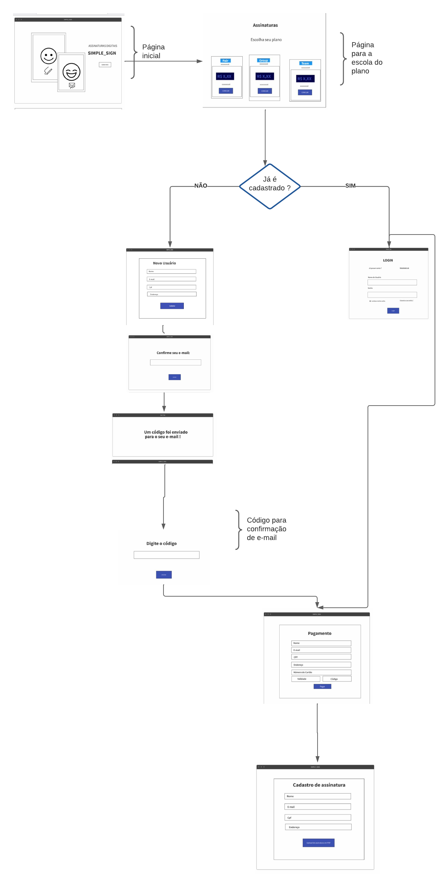
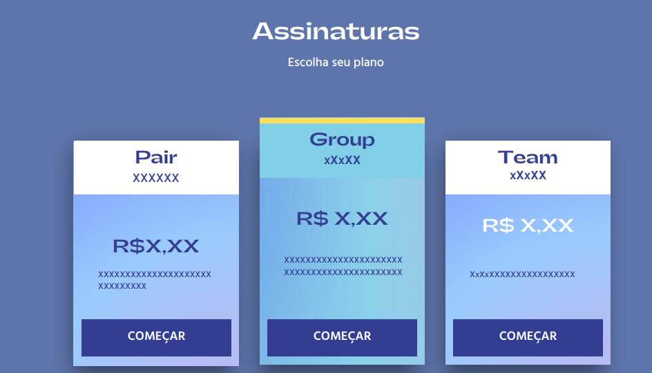
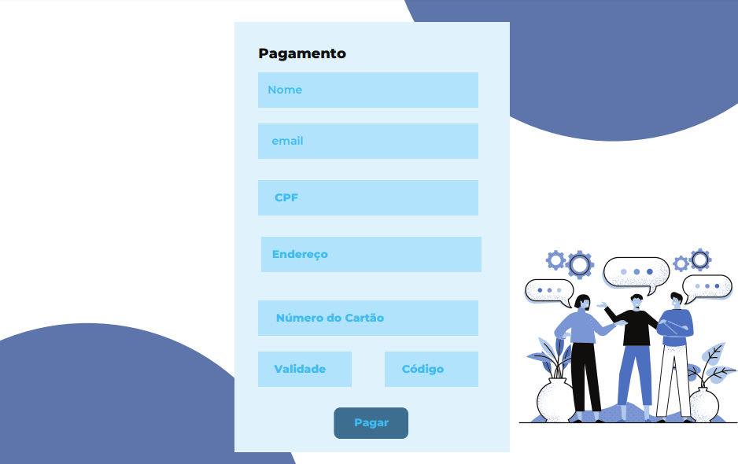

# Projeto de Interface

Visão geral da interação do usuário pelas telas do sistema e protótipo interativo das telas com as funcionalidades que fazem parte do sistema (wireframes).

## Diagrama de Fluxo

O diagrama apresenta o estudo do fluxo de interação do usuário com o sistema interativo e  muitas vezes sem a necessidade do desenho do design das telas da interface. Isso permite que o design das interações seja bem planejado e gere impacto na qualidade no design do wireframe interativo que será desenvolvido logo em seguida.

## Wireframes

Conforme fluxo de telas do projeto, apresentado no item anterior, as telas do sistema são apresentadas em detalhes nos itens que se seguem. 

1. Ao acessar o site, o usuário clica em "conhecer mais" para poder processar o pagamento.

2. Na segunda tela, tem-se as opções de pagamento com os pacotes específicos. 

3. Ao clicar em qualquer um dos pacotes disponíveis, o usuário é direcionado para a tela de pagamento.

6. Após realizar o pagamento, o usuário é encaminhado para uma tela de cadastro.
7. Ao enviar os dados do seu cadastro, o usuário realiza o login.
8. Caso esqueça a senha de acesso, é encaminhado para outra tela para preenchimento do e-mail e o sistema envia o um código. 
9. Com o código copiado, o usuário preenche no local indicado no site.
10. Ao realizar o login corretamente, o usuário acessa seu painel de controle, onde estão arquivados os documentos assinados e os documentos pendentes para assinar. Assim como a opção de subir um novo documento para compartilhamento.
11. Quando o usuário clica (na tela 8) nos botões verde "assinados", amarelo "aguardando", vermelho "assinados": é encaminhado para a tela onde estão listados todos documentos assinados e pendentes.
12. Quando o usuário clica no botão azul "novo documento", ele é encaminhado à tela onde realizará sua assinatura digital.
13. Ao clicar em "publicar documentos" o usuário é encaminhado para que faça o upload de seu documento.

Abaixo o Protótipo Interativo em PDF:

[WireFrame_interativo.pdf](https://github.com/ICEI-PUC-Minas-PMV-ADS/pmv-ads-2022-1-e2-proj-int-t5-Simple_Sign/files/8427663/WireFrame_interativo.pdf)

