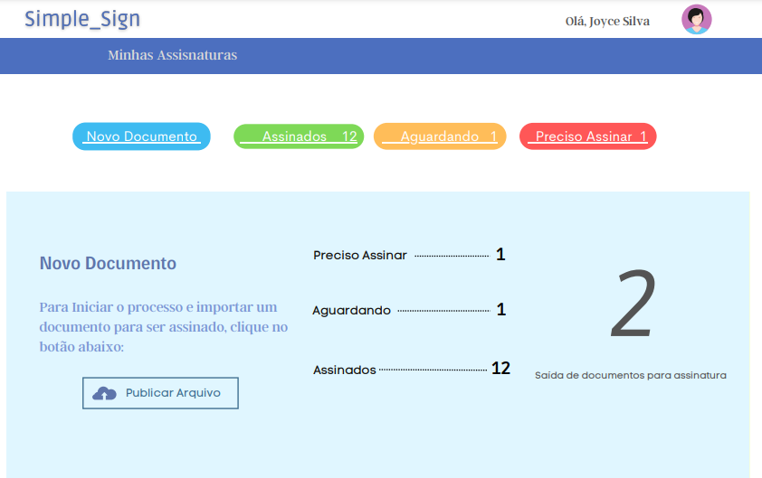
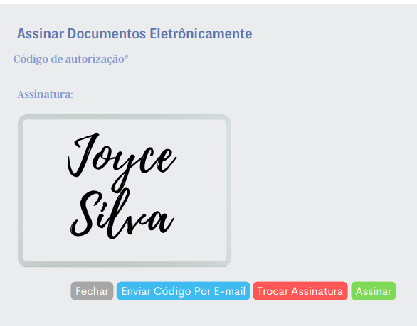
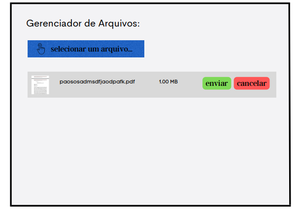

# Template Padrão da Aplicação

O template criado é composto pelos seguintes layouts:
* Tela inicial
* Escolha seu plano de assinatura
* Tela de pagamento
* Cadastro de usuário
* Tela de login
* Confirmação de e-mail
* Dashboard
* Assinatura eletrônica
* Gerenciador de arquivos

A responsividade segue o padrão Bootstrap.

## Tela inicial
Tela que chama o usuário a dar início à interação através do botão "Saiba mais".

## Escolha seu plano de assinatura
Foi criado para que o usuário escolha o plano que mais se adequa sua necessidade.

## Tela de pagamento
Permite que o usuário faça o pagamento de acordo com o plano escolhido.

## Cadastro de usuário
É a tela onde o usuário realiza o cadastro as suas informações pessoais, incluindo a própria assinatura pessoal ou corporativa.

## Tela de login
É onde o usuário fará o acesso ao sistema através das credenciais cadastradas anteriormente.

## Confirmação de e-mail
Tela utilizada para gerar um e-mail de confirmação ao usuário, que o receberá automaticamente.

## Dashboard
Tela onde o usuário fará a administração dos seus documentos a serem assinados.

## Assinatura eletrônica
Tela criada para assinar eletronicamente um documento.

## Gerenciador de arquivos
É onde o usuário fará o upload do documento a ser assinado.

