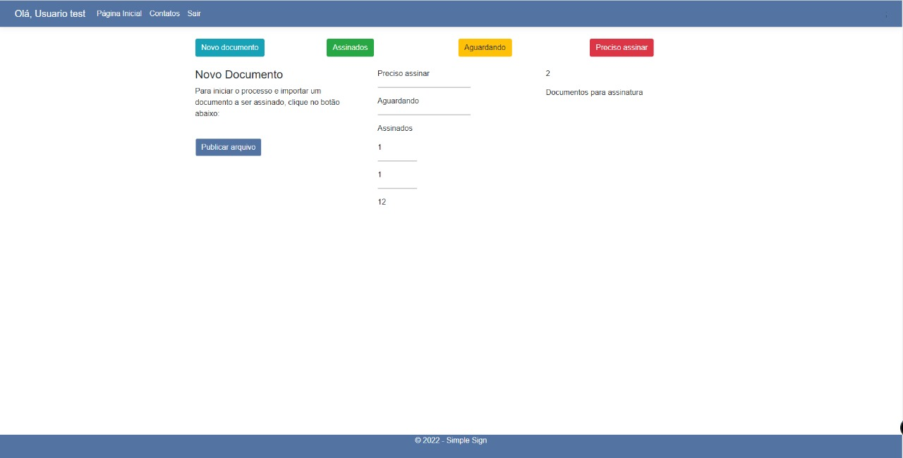
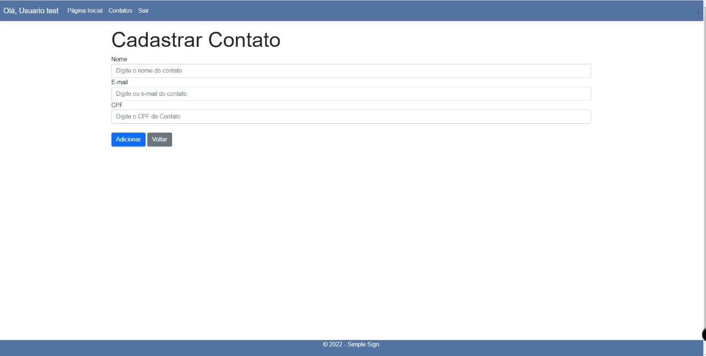

# Registro de Testes de Software

Pré-requisitos: <a href="3-Projeto de Interface.md"> Projeto de Interface</a>, <a href="8-Plano de Testes de Software.md"> Plano de Testes de Software</a>

Relatório com as evidências dos testes de software realizados no sistema pela equipe, baseado em um plano de testes pré-definido.

## Cadastro

Primeiramente o usuário precisará realizar o seu cadastro na plataforma Simple Sign, será necessario algumas informações tais como nome, cpf, e-mail e senha.

## Login

Ao acessar a página web de login é apresentada ao usuário e nela é possível inserir as seguintes informações: CPF e senha.

## Dashboard

Continuando o plano de testes, depois de realizar o login, constatamos que o usuário é direcionado à página que mostra os instrumentos de que terá acesso para suas assinaturas. Essa página, que chamamos de Dashboard apresenta também a página de acesso cujo menu lateral possui 3 ferramentas: Páginia Inicial, Contatos e Sair.

## Cadastro de Contatos

Na página de cadastro é possível cadastrar um novo contato, com as seguintes informações: nome, e-mail e cpf. 

 
 ## Lista de Contatos

Na lista é possível editar e apagar os contatos cadastrados.

## Editar Contato

Nesta página o usário poderá editar qualquer informação do contato.

