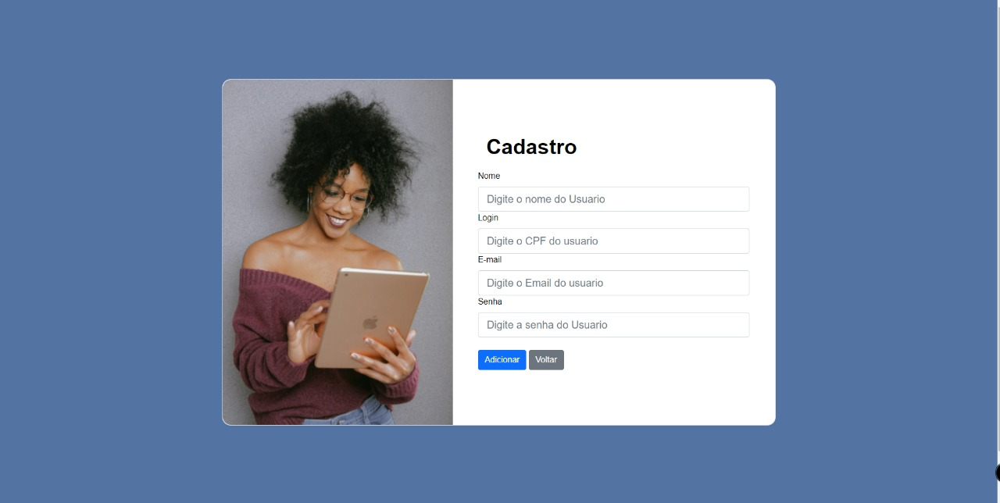

# Registro de Testes de Software

Pré-requisitos: <a href="3-Projeto de Interface.md"> Projeto de Interface</a>, <a href="8-Plano de Testes de Software.md"> Plano de Testes de Software</a>

Relatório com as evidências dos testes de software realizados no sistema pela equipe, baseado em um plano de testes pré-definido.

## Cadastrar Perfil

Primeiramente o usuário precisará realizar o seu cadastro na plataforma Simple Sign, será necessario algumas informações tais como nome, cpf, e-mail e senha.

Um exemplo é apresentado no vídeo abaixo:

https://user-images.githubusercontent.com/90660755/173379693-c61db60e-27d7-4d81-950e-981c2eb2d732.mp4

## Efetuar login

Ao acessar a página de login o usuário irá inserir as seguintes informações: CPF e senha.

Um exemplo é apresentado no vídeo abaixo:

https://user-images.githubusercontent.com/90660755/173382064-f4b41c29-a6db-4126-b67c-97a9d18687ba.mp4

## Recuperação de Senha

Ao acessar a página de recuperação de senha o usuário irá inserir as seguintes informações: CPF e E-mail.

Um exemplo é apresentado no vídeo abaixo:

https://user-images.githubusercontent.com/90660755/175104888-a52f399c-f0a5-437e-97eb-2214d5eb0c5e.mp4

## Cadastro de Contatos

Na página de cadastro é possível cadastrar um novo contato, com as seguintes informações: nome, e-mail e cpf. 

Um exemplo é apresentado no vídeo abaixo:

https://user-images.githubusercontent.com/90660755/173386503-8751c98a-38ef-4ba5-ad51-e5927e6c5424.mp4

## Editar Contato

Nesta página o usário poderá editar qualquer informação do contato.

Um exemplo é apresentado no vídeo abaixo:

https://user-images.githubusercontent.com/90660755/173387989-948ea9b6-f1d5-4129-b4a1-c83c75ea942c.mp4

## Apagar Contatos

Na lista de contatos é possível apagar os contatos cadastrados.

Um exemplo é apresentado no vídeo abaixo:

https://user-images.githubusercontent.com/90660755/173387378-1402e17a-86b3-420b-bc69-4a30543b0028.mp4

## Responsividade

A aplicação está responsiva.

Aplicação em tela cheia

A aplicação em tela reduzida

## Design

Design simples e autoexplicativo.

Um exemplo é apresentado no vídeo abaixo:

https://user-images.githubusercontent.com/90660755/175330772-5d5672f7-cc3f-4376-a403-590882eaeeeb.mp4

## Dashboard

Continuando o plano de testes, depois de realizar o login, constatamos que o usuário é direcionado à página que mostra os instrumentos de que terá acesso para suas assinaturas. Essa página, que chamamos de Dashboard apresenta também a página de acesso cujo menu superior possui quatro ferramentas: Páginia Inicial, Contatos, Arquivos e Sair.

